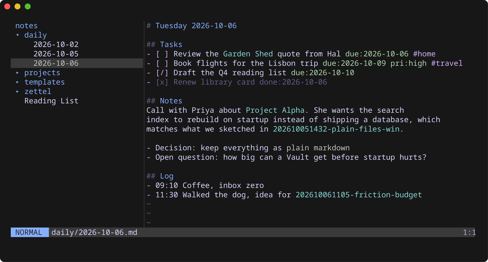
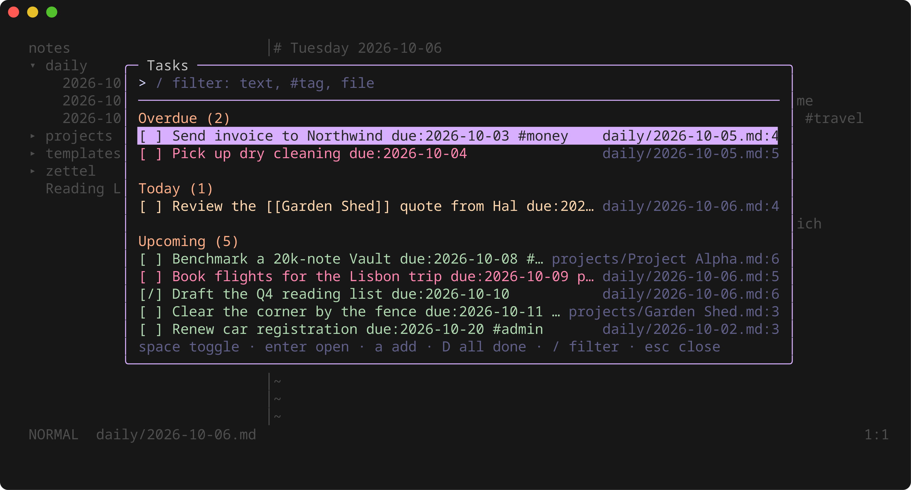

# pholio

A terminal markdown editor for a folder of notes, with a vim-style editor built in.

pholio opens a **Vault**, a plain folder of `.md` files, and gives you a file tree, a modal editor, and the tools for a daily-notes workflow: Daily Notes, a Vault-wide Task List, `[[wikilinks]]` with Backlinks, and quick Zettel creation. There's no database. The index is rebuilt in memory on every start, and syntax stays Obsidian-compatible, so the same Vault opens fine in other tools.





## Install

pholio runs on Linux and macOS; Windows is not supported.

**Homebrew** (macOS):

```sh
brew install --cask tedkulp/tap/pholio
```

**Debian or RPM**, from the [latest release](https://github.com/tedkulp/pholio/releases/latest):

```sh
sudo dpkg -i pholio_<version>_linux_amd64.deb     # or
sudo rpm -i pholio_<version>_linux_amd64.rpm
```

**An archive**, for anything else (each release also carries `checksums.txt`):

```sh
tar -xzf pholio_<version>_linux_amd64.tar.gz
install -m 755 pholio ~/.local/bin/pholio
```

**With Go** 1.27 or newer:

```sh
go install github.com/tedkulp/pholio/cmd/pholio@latest
```

Or build from a clone with [just](https://github.com/casey/just):

```sh
git clone https://github.com/tedkulp/pholio
cd pholio
just build        # writes bin/pholio
```

## Quick start

```sh
pholio init ~/notes   # optional: folders, a daily Template and a commented .pholio/config.toml
pholio ~/notes
```

pholio opens today's Daily Note (`daily/YYYY-MM-DD.md`), creating it if needed. Press `spc` in normal mode to see the leader keys, `spc ?` for every key, and `ctrl+q` to quit.

To skip the path argument, set your Vault once in `~/.config/pholio/config.toml`:

```toml
vault = "~/notes"
```

`pholio <file>` opens a single Note instead.

`pholio init [folder]` (the current folder if none is given) creates whatever is missing of `daily/`, `zettel/`, `templates/daily.md` and `.pholio/config.toml`, never overwriting a file, and sets `vault` in the user config if it isn't set yet. To open a folder named `init`, run `pholio ./init`.

## Keys

The editor is vim: counts, motions, `d`/`c`/`y`, text objects (including markdown `i*` and `i_`), visual modes, undo/redo, `.`, `/` search, and `:w :q :wq :q! :e :e!`. There are no macros or `:s`.

| Key | Action | Command |
|---|---|---|
| `spc d` | today's Daily Note | `:today` |
| `[d` / `]d` | previous / next existing Daily Note | |
| `spc D` | jump to a date (ISO or `tomorrow`, `fri`, `+2w`…) | `:daily <date>` |
| `spc t` | Task List | `:tasks` |
| `spc T` | Task Editor for the Task on the cursor line | `:task` |
| `spc f` | find a Note | `:find [query]` |
| `spc /` | search the Vault | `:grep [query]` |
| `spc b` | Backlinks to this Note | `:backlinks` |
| `spc z` | new Zettel, linked from here | `:zettel [title]` |
| `spc n` | new Note | `:new <name>` |
| | rename / delete this Note | `:rename <path>`, `:delete` |
| `spc e` | toggle the sidebar | `:sidebar` |
| `spc ?` | help: every key, filterable; `enter` runs one | |
| `enter` / `gd` | follow the Link under the cursor | |
| `ctrl+o` / `tab` | jump back / forward | |
| `ctrl+h` / `ctrl+l` | focus sidebar / editor (or `ctrl+shift+h` / `ctrl+shift+l`) | |
| `F7` / `F8` | cycle theme / reload config and theme | |
| `ctrl+q` / `spc q` | quit (asks if there are unsaved changes) | `:q` |

In the sidebar, `a` adds a Note (end the name with `/` for a folder), `r` renames or moves, `d` deletes to the system trash, `.` shows dotfiles, and `<` / `>` resize it. Renaming offers to update every Link that points at the Note.

## Tasks

A Task is any `- [ ]` checkbox outside code blocks and `templates/`:

```markdown
- [ ] Call the bank [due:: fri] [priority:: high] #money
- [/] Draft the report [due:: +3d]
- [x] Renew passport [completion:: 2026-10-01]
- [-] Cancelled idea
```

`[ ]` and `[/]` are open, `[x]` is done, `[-]` is cancelled.

Task Metadata uses the two formats of Obsidian's Tasks plugin, so a Vault reads the same in both apps. pholio reads both, even mixed on one line:

| | `dataview` (default) | `emoji` |
|---|---|---|
| due | `[due:: 2026-10-10]` | `📅 2026-10-10` |
| done | `[completion:: 2026-10-10]` | `✅ 2026-10-10` |
| priority | `[priority:: high]` | `🔺` highest, `⏫` high, `🔼` medium, `🔽` low, `⏬` lowest |
| scheduled, start, created, cancelled | `[scheduled:: …]`, `[start:: …]`, `[created:: …]`, `[cancelled:: …]` | `⏳`, `🛫`, `➕`, `❌` |

Dataview fields may also use `(due:: …)`. When you leave insert mode, relative due and done dates like `fri` or `+3d` are rewritten as ISO dates. Checking a Task off appends today's done date (before a trailing `^block-id`), and unchecking removes it. pholio writes it in the format of the line's first field, or `task_format` if the line has none.

The Task List (`spc t`) groups open Tasks into Overdue, Today, Upcoming and No date, and sorts each group by due date, then priority (highest, high, medium, none, low, lowest). In it, `space` toggles, `enter` jumps to the line, `e` edits the Task, `a` adds a Task to today's Daily Note, `D` shows all done and cancelled Tasks, and `/` filters by text, `#tag` or file.

The Task Editor is a form for one Task: its Description (text and `#tags`), Status (open, in progress, done, cancelled), Due, Scheduled and Start dates, and Priority. Open it with `spc T` or `:task` on a Task's line, or `e` in the Task List; the Task List's `a` opens it empty. `tab` / `shift+tab` move between rows, `space`, `←` and `→` change Status and Priority, and the date rows take ISO dates or `today`, `fri`, `+3d`…, saved as ISO dates. An empty date row removes the field. `enter` saves, unless a date row isn't a date, and `esc` discards the edits. Saving rebuilds the line as checkbox, Description, then its fields (each in its own format, new ones in the line's format or `task_format`), then any `^block-id`; fields the form doesn't show, like `[created:: …]` or `✅ …`, are kept. In the open Note the save is one undoable change to the buffer; other Notes are rewritten on disk.

## Configuration

Every key has a default, so no config file is needed. pholio never writes to these files.

**User config**, `$XDG_CONFIG_HOME/pholio/config.toml` (default `~/.config`, on macOS too):

| Key | Default | |
|---|---|---|
| `vault` | | Vault to open when no path is given |
| `theme` | `"default"` | `default`, `light`, `ansi16`, or a user theme |
| `mouse` | `true` | wheel scroll, clicks, sidebar drag-resize |
| `wrap` | `true` | soft word-wrap; `false` scrolls sideways |
| `conceal` | `true` | hide `[[ ]]`, `**`, `~~`, backticks and link URLs off the cursor line |
| `open_daily_on_startup` | `true` | |

**Vault config**, `<vault>/.pholio/config.toml` (these keys can also go in the user config; the Vault file wins):

| Key | Default |
|---|---|
| `day_starts_at` | `"00:00"` (e.g. `"04:00"` keeps 1am on the previous day) |
| `daily_folder` | `"daily"` |
| `daily_template` | `"templates/daily.md"` |
| `daily_subfolder` | `""` (e.g. `"YYYY/MM"` puts new Daily Notes in `daily/2026/10/2026-10-06.md`) |
| `zettel_folder` | `"zettel"` |
| `new_note_folder` | `""` (the Vault root) |
| `tasks_heading` | `"## Tasks"` (where the Task List's `a` adds Tasks) |
| `task_format` | `"dataview"` (or `"emoji"`: the Task Format pholio writes done dates in) |

Daily templates can use `{{date}}`, `{{date:FMT}}`, `{{time}}`, `{{time:FMT}}`, `{{title}}`, `{{yesterday}}` and `{{tomorrow}}`, with moment-style formats such as `{{date:dddd, MMMM D}}`.

`daily_subfolder` uses the same moment-style format and sets only the folders; the file name stays `YYYY-MM-DD.md`, so `[[2026-10-06]]` Links keep working. Existing Daily Notes aren't moved, and `[d` / `]d` step through flat and nested Daily Notes together.

Unknown keys and bad values are reported once on the status line, and those keys use their defaults.

### Themes

Put themes in `~/.config/pholio/themes/<name>.toml` and select one with `theme = "<name>"` or `F7`. A theme only needs the colours and styles it changes; everything else falls back to the default theme. See [`internal/theme/themes/default.toml`](internal/theme/themes/default.toml) for every style slot.

```toml
[palette]
accent = "#ff8800"

[ui]
mode_normal = { fg = "bg", bg = "accent", bold = true }
```

## Working with other tools

pholio watches the Vault, so edits from Obsidian, Syncthing or `git pull` show up live. An unmodified buffer reloads silently. If you have unsaved changes, pholio warns you, and `:w` asks before overwriting. Syncthing `*.sync-conflict-*` files show in the sidebar but are left out of Tasks and Link resolution.

## Development

```sh
just          # list recipes
just test     # go test ./...
just ci       # vet, race tests and golangci-lint, as CI runs them
just golden   # regenerate View() snapshot files
just snapshot # build every release artifact into dist/ without publishing
just screenshots # regenerate docs/screenshots from the demo Vault (needs tmux)
```

Pushing a `v*` tag publishes a release through [GoReleaser](https://goreleaser.com/): archives, deb and rpm packages, and the Homebrew cask in [tedkulp/homebrew-tap](https://github.com/tedkulp/homebrew-tap).

```sh
git tag -a v0.1.0 -m "Release v0.1.0"
git push origin v0.1.0
```

The v1 behaviour is specified in [issue #17](https://github.com/tedkulp/pholio/issues/17), and domain terms (Note, Vault, Link, Task…) are defined in [`GLOSSARY.md`](GLOSSARY.md).

## License

[MIT](LICENSE)
